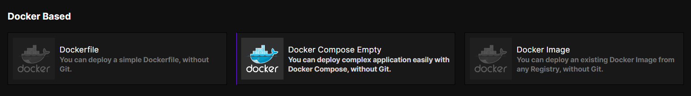

---

### **Step 1: Log in to Coolify**

1. Open your Coolify instance in your browser.
2. Log in with your admin credentials.  
   
---

### **Step 2: Create a New Application**

1. Navigate to the **"Applications"** tab in the sidebar.


2. Click on the **"Add Application"** button.

---

### **Step 3: Configure Application Settings**

1. **Select Deployment Type**:
    - Choose **"Docker Compose"**.  
      **Screenshot**: 


### **Step 4: Upload `docker-compose.yml`**

1. In the **"Docker Compose File"** section, paste the following content:

   ```yaml
   version: '3.8'

   services:
     mailserver:
       image: analogic/poste.io
       container_name: mailserver
       hostname: ${POSTEO_HOST_NAME}
       environment:
         - TZ=${TZ}
         - POSTEO_DOMAIN=${POSTEO_DOMAIN}
         - POSTEO_ADMIN_PASSWORD=${POSTEO_ADMIN_PASSWORD}
         - POSTEO_POSTMASTER_PASSWORD=${POSTEO_POSTMASTER_PASSWORD}
       volumes:
         - ./data:/data
         - ./mail:/mail
         - ./certs:/etc/ssl/certs
       ports:
         - "25:25"
         - "143:143"
         - "88:80"
         - "8443:443"
       restart: unless-stopped
   ```

2. Save the configuration.  
   **Screenshot**: 

---
### **Step 5: Set Up Environment Variables**

1. Go to the **"Environment Variables"** tab.  
   
2. Add the required variables from the `.env` file:
   ```env
    TZ=UTC
    POSTEO_DOMAIN=your-domain.com
    POSTEO_HOST_NAME=mail.your-domain.com
    POSTEO_ADMIN_PASSWORD=your-admin-password
    POSTEO_POSTMASTER_PASSWORD=your-postmaster-password
   ```

    - Use the **"Add Variable"** button for each entry.
    - Ensure all values are filled correctly.  
      **Screenshot**: 

---
### **Step 6: Deploy the Application**

1. Click the **"Deploy"** button.  
   
2. Wait for the deployment logs to confirm a successful setup.  
   **Screenshot**: 

---

### **Step 7: Verify Your Mail Server**

1. Visit the web interface:
    - Non-SSL: `http://<your-server-ip>:8443`
    - SSL (if configured): `https://<your-server-domainp>:8443`  
      **Screenshot**: 

2. Log in with the admin credentials set in your environment variables.

---

### **Step 8: - Configure DNS**

1. Update your domain’s DNS records for proper mail delivery:
    - **MX Record**: Points to your server’s IP or hostname.
    - **SPF, DKIM, DMARC**: For better email deliverability.
   https://poste.io/doc/configuring-dns
     
---

### Conclusion

Your Poste.io mail server should now be fully operational on Coolify!  
If you encounter any issues, check the logs on Coolify or refer to the **Poste.io documentation** for troubleshooting.

---